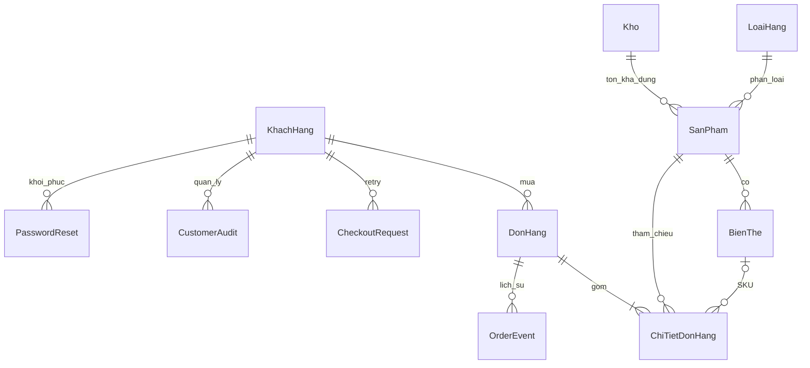

# Fashion Haven

Hệ thống bán lẻ thời trang gồm ứng dụng khách hàng, trang quản trị và API dùng chung. Tình trạng triển khai và kiểm chứng ngày **06/10/2026** được ghi trong [COMPLETED_FEATURES.md](COMPLETED_FEATURES.md); các hạng mục tiếp theo nằm trong [PLAN.md](PLAN.md).

## Nguồn đang sử dụng

| Thư mục | Vai trò thực tế |
| --- | --- |
| `FE` | Ứng dụng khách hàng React Native, **Expo SDK 57**, Expo Router. `app` khai báo route, `pages` triển khai màn hình; `components/fashion-data.ts` quản lý API, giỏ theo tài khoản và hợp nhất giỏ khách. |
| `admin_web` | Trang quản trị React, TypeScript, Vite; dùng API trong `BE`. |
| `BE` | REST API Express, TypeScript, Prisma; database provider **MySQL**, không phải SQL Server. Ảnh catalog/bài viết chính tại `BE/public/images`. |
| `fashion_ui1`, `fashion_ui2` | Bản thiết kế HTML/hình ảnh tham khảo; không phải ứng dụng đang chạy. |
| `fashionheaven` | Ứng dụng CRA cũ được giữ lại; `public/images` còn là nguồn ảnh fallback khi ảnh không có trong thư mục chính của backend. |

Phát triển chức năng khách hàng trong `FE`, chức năng nội bộ trong `admin_web`. Không xóa các bản tham khảo hoặc thư mục chứa ảnh khi chưa kiểm tra phụ thuộc.

## Chạy tại máy phát triển

Từ bản clone mới: `git clone https://github.com/quangduong0412/Fashion_Shop.git`, rồi `cd Fashion_Shop`. Clone mang source/assets phát hành; MySQL, tài khoản và ảnh upload cần kết nối/khôi phục riêng từ cấu hình và bản sao lưu do người vận hành quản lý. Các migration tương thích giả định database ứng dụng đã có các bảng cơ sở; không chạy SQL có DROP để chữa lỗi kết nối hoặc tạo demo trên database cửa hàng.

Các lệnh dưới đây dùng PowerShell trên Windows; mở một terminal riêng cho mỗi ứng dụng. Cần Node.js tương thích với dependency hiện có và một MySQL database đã được cấu hình.

### Backend — cổng 4000

```powershell
cd BE
npm.cmd ci
if (-not (Test-Path -LiteralPath .env)) { Copy-Item .env.example .env }
node -e "console.log(require('crypto').randomBytes(32).toString('hex'))"
# Điền DATABASE_URL và JWT_SECRET được tạo vào .env tại máy này
npm.cmd run dev
```

Không ghi đè `.env` đang dùng. `JWT_SECRET` phải có ít nhất 32 ký tự; backend không còn khóa dự phòng. Sau khi thay khóa hoặc đổi mật khẩu, đăng nhập lại.

`dev` và `start` tự chạy `db:prepare` trước khi mở API. **Đọc [BE/README.md](BE/README.md) trước khi chạy với database chưa đối chiếu schema**: ngoài phần thêm bảng/cột, bước tương thích có thể đổi tên `phieuxuat`/`ctphieuxuat` sang `donhang`/`ctdonhang`.

### Admin — cổng 5173

```powershell
cd admin_web
npm.cmd ci
npm.cmd run dev
```

API mặc định là `http://<hostname của trình duyệt>:4000/api`. Với môi trường khác, cấu hình `VITE_API_URL` theo `admin_web/.env.example` rồi khởi động lại Vite.

### Khách hàng — Expo, web thường dùng cổng 8081

```powershell
cd FE
npm.cmd ci
npm.cmd run web
# Hoặc npm.cmd start để chọn thiết bị phát triển
```

`EXPO_PUBLIC_API_URL` đặt URL API; `EXPO_PUBLIC_ADMIN_URL` đặt URL trang quản trị. Trên Android emulator, API mặc định dùng `10.0.2.2:4000`; thiết bị thật cần IP LAN của máy backend hoặc URL triển khai. Các biến `EXPO_PUBLIC_*` và `VITE_*` là dữ liệu công khai, không chứa secrets.

## Dữ liệu và kiểm tra

**Không chạy `FashionHeaven.sql` trên database đang có dữ liệu: file mở đầu bằng `DROP DATABASE`.** Đây là bản thiết kế/khởi tạo tham khảo, không phải migration vận hành. Không chạy seed, reset hoặc `prisma db push` trên database thật khi chưa xem tác động và được phép.

| Khu vực | Lệnh kiểm tra |
| --- | --- |
| `BE` | `npm.cmd run typecheck`; `npm.cmd test` |
| `admin_web` | `npm.cmd run typecheck`; `npm.cmd run lint`; `npm.cmd run build` |
| `FE` | `npx.cmd tsc --noEmit`; `npm.cmd run lint`; `npx.cmd expo export --platform web` |

Test backend tạo database **mới** dạng `fashionhaven_test_<timestamp>_<random>` trên MySQL local. Runner đóng tiến trình/kết nối và dọn đúng database do lần chạy đó tạo trong `finally`, kể cả setup/test lỗi. `KEEP_TEST_DB=true` giữ lại có chủ đích để debug. Cần quyền CREATE/DROP DATABASE; không tạo fixtures trong database cửa hàng. Lệnh liệt kê trước khi dọn: `cd BE; npm.cmd run test:db:list`. Xem [quy tắc cleanup và danh sách đã dọn](BE/TEST_DATABASE_CLEANUP.md).

Kiểm tra trình duyệt tùy chọn dùng bản build thật `FE/dist`, `admin_web/dist`, Express và MySQL kiểm tra. Lượt mới nhất đạt **79/79** (52 integration API/MySQL, 25 unit, 1 browser và nhóm cha). Phạm vi web và giới hạn thiết bị native nằm trong [COMPLETED_FEATURES.md](COMPLETED_FEATURES.md); không dùng kết quả checkpoint cũ để nghiệm thu mã mới.

### Khách hàng thử nghiệm riêng

Trong `BE/.env` local, đặt `NODE_ENV=development`, `ALLOW_DEMO_CUSTOMER=true`, `DEMO_CUSTOMER_EMAIL`, `DEMO_CUSTOMER_PASSWORD` (8 ký tự trở lên, tối đa 72 byte UTF-8), tùy chọn `DEMO_CUSTOMER_NAME`. Sau đó:

```powershell
cd BE
npm.cmd run demo:customer
```

Script chỉ chạy có chủ đích trên MySQL phát triển local ngoài production, tạo tài khoản trong database FE đang kết nối, hash bcrypt, ghi audit và **không đổi mật khẩu/hồ sơ nếu email đã tồn tại**. Không commit/gửi mật khẩu qua chat. Hiện chưa cấp tài khoản mới trên máy này vì chưa có mật khẩu do người vận hành cấu hình; cơ chế cấp được kiểm tra bằng dữ liệu tổng hợp riêng.

Quên mật khẩu có token 15 phút dùng một lần và thu hồi session. Với local: đặt `NODE_ENV=development`, `RESET_DELIVERY_MODE=file`, `CUSTOMER_WEB_URL=http://localhost:8081`; liên kết xuất tại `BE/dev-outbox/<database-hash>/*.json` riêng tư, không trả token trong API. Email thật cần `RESET_DELIVERY_MODE=resend`, `RESEND_API_KEY`, `RESET_EMAIL_FROM` và URL FE HTTPS. Phần gửi email nhà cung cấp chưa được nghiệm thu thực tế; thiếu cấu hình trả lỗi rõ ràng.

Seed tài khoản không chạy tự động: `BE/prisma/seed.ts` và `BE/add_sample_data.ts` chỉ cho phép phát triển với `ALLOW_SAMPLE_PROVISIONING=true`, yêu cầu các mật khẩu `SEED_ADMIN_PASSWORD`, `SEED_STAFF_PASSWORD`, `SEED_CUSTOMER_PASSWORD` do người vận hành đặt. Không có mật khẩu mẫu cố định; seed bị chặn khi `NODE_ENV=production`. Không chạy seed trên dữ liệu thật để xử lý lỗi kết nối.

`.env` đã được loại khỏi danh sách theo dõi Git. Thông tin kết nối từng được commit vẫn có thể tồn tại trong lịch sử; chủ database cần thay thông tin xác thực đã lộ trước khi đưa hệ thống ra ngoài máy phát triển.

12 ảnh catalog/bài viết đang được tham chiếu (khoảng 7,75 MB) đã được đưa vào `BE/public/images` để bản clone có đủ assets chính. Backend phục vụ `/images` từ thư mục này trước, rồi fallback sang thư mục ảnh legacy; thư mục legacy vẫn được giữ. Ảnh người dùng tải lên nằm trong `BE/uploads`, bị loại khỏi Git và cần sao lưu/khôi phục riêng khi chuyển máy hoặc triển khai.

## Kịch bản demo hiện có

1. Admin cấu hình thông tin cửa hàng, phí giao cho một lần checkout, chính sách và banner; tạo danh mục/ảnh, sản phẩm, bộ ảnh và từng SKU size–màu với tồn riêng.
2. Khách đăng nhập bằng tài khoản được cấp riêng; xem sản phẩm, chọn SKU, chọn các dòng giỏ muốn mua, điền địa chỉ/ghi chú, xem **tiền hàng + phí giao − giảm giá = tổng thanh toán**, xác nhận COD.
3. Admin/nhân viên xác nhận → đóng gói → nhập vận đơn và bàn giao → giao thành công; admin ghi căn cứ đối soát COD. Khách theo dõi đơn và vận đơn.
4. Khách chỉ hủy khi đơn còn PENDING; tồn khả dụng hoàn đúng một lần. Nhập kho dùng DRAFT → RECEIVED, không cộng tồn lúc tạo nháp.
5. Admin quản lý trạng thái tài khoản/audit, đăng bài để FE đọc chi tiết; xem báo cáo aggregate theo ngày tạo đơn UTC+7, xuất CSV. Phân biệt giá trị đơn đã giao với tiền đã đối soát.

Phí giao lấy từ database và chia vào các đơn theo kho, tổng không đổi; retry dùng snapshot cũ. Chỉ COD; **voucher, đổi trả/hoàn tiền, đánh giá, thông báo và CMS nháp/lịch xuất bản bài viết còn thiếu**. Banner đã có trạng thái/lịch hiển thị riêng. Không bật thanh toán online giả hoặc tự sửa chứng từ cũ. Bảng theo dõi đầy đủ ở [PLAN.md](PLAN.md).

## Mô hình dữ liệu cốt lõi



Đây là sơ đồ quan hệ nghiệp vụ chính, không khẳng định mọi cạnh là foreign key vật lý; xem schema Prisma đầy đủ. Model `PhieuXuat` map tới bảng `donhang`, model `CTDonHang` map tới `ctdonhang` để giữ tương thích. `StoreSettings`/`SettingsAudit` lưu cấu hình có version; snapshot tiền/ảnh/thông tin đơn không thay đổi theo catalog hoặc cài đặt mới.

## Mua sắm theo tài khoản (đợt 1)

Đã có yêu thích, bộ lọc brand/giá/size/màu, sổ nhiều địa chỉ/default và giỏ qua API. Vào Tài khoản → Sản phẩm yêu thích / Địa chỉ nhận hàng. Bộ sưu tập → Lọc & sắp xếp; điều kiện cùng SKU, giá listing là giá thấp nhất khớp. Chưa có ngày tạo sản phẩm nên chỉ sắp mã/giá. Trong giỏ có đổi size/màu, đồng bộ lại và giữ các dòng chưa chọn.

Giỏ khách vãng lai hợp nhất một lần khi đăng nhập, cộng số lượng SKU trùng và giữ lựa chọn. Phần guest được gắn với tài khoản trước khi gửi; logout/đổi khách không sao chép giỏ account sang guest. Nếu guest không đủ tồn, hệ thống giữ giỏ account và thông báo phần chưa hợp nhất để thử lại hoặc bỏ có chủ đích. Không giữ tồn chỉ vì thêm giỏ. Checkout COD kiểm tra phiên bản giỏ/địa chỉ, lưu snapshot và bỏ lượng đã mua trong transaction; retry sau mất phản hồi không tạo/trừ lần hai.

Migration mới: `cd BE`, `npm.cmd run db:migrate-customer-shopping`, `npx.cmd prisma generate`; `db:prepare` đã bao gồm bước này. Trên máy hiện tại đã áp dụng và chạy lại, dữ liệu 16 SP/134 SKU/6 đơn/6 dòng giữ nguyên; bốn bảng mới chưa có dữ liệu thử. Không chạy SQL DROP/seed. Checkpoint và báo cáo: [docs/IMPLEMENTATION_PROGRESS.md](docs/IMPLEMENTATION_PROGRESS.md), [docs/REPORT_UPDATES.md](docs/REPORT_UPDATES.md).

## Bộ dữ liệu demo local — 65 bản ghi mỗi nhóm

Đã cấp database riêng `fashionhaven_demo_v1`, API dùng cổng 4000. Mở [ứng dụng khách hàng](http://localhost:8081) hoặc [trang quản trị](http://localhost:5173). Khách: `demo.customer001@example.invalid` … `demo.customer065@example.invalid`; admin: `demo.admin@example.invalid`. Mật khẩu do người vận hành cung cấp được ghi riêng tại `BE/private-maintenance/demo-login.txt`, không commit. Database giữ bcrypt; không có chức năng xem mật khẩu cũ từ hash.

Khởi động lại API demo: vào `BE`, đặt `$env:NODE_ENV='development'`, chạy `npm.cmd run demo:dev`. API này chọn database demo trong process, không sửa `DATABASE_URL` gốc. `npm.cmd run dev` chạy chế độ database cửa hàng gốc; hai API không dùng cùng port đồng thời. Hướng dẫn cấp dữ liệu có opt-in và chạy lại an toàn: [BE/README.md](BE/README.md).
