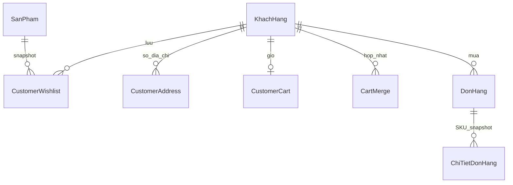

# Nội dung cập nhật báo cáo Fashion Shop — 06/10/2026

## Chương 1 — Mục tiêu, phạm vi và giới hạn

Hệ thống Fashion Haven được phát triển theo ba ứng dụng: khách hàng React Native/Expo, quản trị React/Vite và REST API Express/TypeScript dùng Prisma kết nối MySQL. Ngoài luồng COD đã có, đợt 1 bổ sung trải nghiệm lưu sản phẩm yêu thích, tìm kiếm theo thuộc tính, sổ địa chỉ và giỏ theo tài khoản. Các chức năng được thực hiện bằng API và dữ liệu thật, có kiểm tra quyền, cập nhật đồng thời và xử lý lỗi. Phạm vi nghiệm thu hiện tại gồm API/MySQL và trình duyệt; chưa chứng minh runtime Android/iOS. Voucher, gateway trực tuyến, trả hàng/hoàn tiền, đánh giá xác minh, push notification và sổ tiền thu/hoàn là hạng mục tiếp theo, không được trình bày như kết quả đã hoàn thành.

## Chương 2 — Cơ sở kỹ thuật thực sự sử dụng

Xác thực và phân quyền được kiểm tra tại backend trên session hiện tại. Dữ liệu mua sắm lấy CustomerId từ token, không lấy quyền hoặc chủ sở hữu từ request body. Các transaction MySQL khóa dòng khách trước khi thay giỏ, địa chỉ mặc định hoặc receipt; version hỗ trợ optimistic concurrency để hai thiết bị không ghi đè nhau. Composite primary key ngăn trùng wishlist và receipt hợp nhất giỏ. Khóa idempotency cho phép gửi lại checkout sau mất kết nối mà không tạo đơn, trừ tồn hoặc xóa lượng giỏ lần hai.

Snapshot tách dữ liệu chứng từ tại thời điểm mua khỏi catalog và sổ địa chỉ có thể thay đổi. Backend tính lại giá SKU, phí giao và tổng; giỏ chỉ thể hiện ý định mua, không giữ tồn. Tồn được giữ trong transaction checkout. Truy vấn catalog dùng SQL tham số hóa, tổng hợp giá thấp nhất từ những SKU khớp đồng thời size, màu và khoảng giá, sau đó phân trang tại MySQL. RepeatableRead giữ count và trang kết quả nhất quán trong một lần đọc. Chưa chuyển Float lịch sử sang Decimal; snapshot tiền mới đã dùng Decimal(18,0) trong luồng COD trước.

## Chương 3 — Model và thiết kế cần bổ sung

| Model / bảng mới | Trường chính | Quan hệ và invariant |
| --- | --- | --- |
| CustomerWishlist / customerwishlist | CustomerId, ProductId, Name, Image, CreatedAt | PK(CustomerId,ProductId); snapshot còn khi sản phẩm ngừng/ẩn/xóa, user bỏ lưu được; max1000 |
| CustomerAddress / customeraddress | Id, CustomerId, Label, Name, Phone, Address, IsDefault, Version, UpdatedAt | Một khách có ≤20 địa chỉ; một default khi có địa chỉ, khóa khách/CAS; không tham chiếu ngược để sửa đơn |
| CustomerCart / customercart | CustomerId, Items JSON, Version, UpdatedAt | Một giỏ/khách; SKU ID, qty, selected, snapshot tên/ảnh; max50, qty1–999; không giữ tồn |
| CartMerge / cartmerge | CustomerId, Key, Fingerprint, CreatedAt | PK(CustomerId,Key), SHA256 canonical payload; cộng lượng đúng một lần, key đổi nội dung bị chặn |

Những quan hệ dưới đây là quan hệ nghiệp vụ; các bảng bổ sung kiểm tra ID qua API, không khai báo foreign key cascade xóa lịch sử snapshot.



Use case bổ sung cho khách gồm: lưu/bỏ yêu thích và xem danh sách; lọc theo danh mục, thương hiệu, giá, size/màu và sắp mã/giá; CRUD/chọn mặc định địa chỉ; đồng bộ/đổi SKU/chọn dòng giỏ; hợp nhất giỏ guest khi đăng nhập. Nhân viên và admin không dùng các endpoint mua sắm cá nhân bằng session nội bộ. Sản phẩm ngừng/ẩn được giữ trong wishlist/giỏ dưới dạng snapshot có thông báo, không được tạo checkout mới. Đơn đã tạo giữ người nhận, giá và ảnh tại thời điểm mua.

Kịch bản hợp nhất cộng qty cho SKU trùng, OR lựa chọn dòng. Guest được gắn chủ và mã receipt bền vững trước request. Nếu vượt tồn, cả merge bị từ chối, phần guest giữ riêng để thử lại hoặc bỏ chủ động; giỏ tài khoản giữ nguyên. Đăng xuất không chuyển giỏ account sang guest. PUT giỏ sai version trả CART_CHANGED và khách phải tải lại. Với địa chỉ, người khác nhận 404; version cũ nhận ADDRESS_CHANGED. Địa chỉ mặc định xóa thì chọn địa chỉ ID nhỏ nhất còn lại. Không có ngày tạo sản phẩm để làm sort thời gian, nên không suy thời gian từ mã ID.

```mermaid
sequenceDiagram
    actor Khach
    participant FE
    participant API
    participant DB as MySQL
    Khach->>FE: Chọn SKU/dòng và địa chỉ
    FE->>API: Quote(items, shipping, cartVersion, addressId)
    API->>DB: Kiểm tra owner/version; đọc giá/tồn/settings
    API-->>FE: Tiền hàng + phí giao − giảm giá; quoteHash
    Khach->>FE: Xác nhận COD
    FE->>API: Checkout(payload, quoteHash, requestKey)
    API->>DB: Transaction: khóa khách, kiểm receipt
    alt Request mới
        API->>DB: Check giỏ/địa chỉ/SKU; khóa stock/settings; quote lại
        API->>DB: Lưu đơn + snapshot; giữ tồn; receipt; bỏ lượng mua trong giỏ
        DB-->>API: Commit
    else Request đã xử lý
        DB-->>API: Receipt và đơn cũ; không trừ thêm
    end
    API-->>FE: Kết quả đơn
    Note over FE,API: Nếu mất phản hồi, FE gửi lại cùng payload/key
```

## Chương 4 — Triển khai, cấu hình và kiểm thử

Backend bổ sung customerShopping/publicCatalog service và shoppingRoutes, giữ controller order/catalog hiện tại để bảo toàn luồng cũ. Frontend bổ sung WishlistProvider/FavoriteButton, route wishlist/addresses, CatalogFilters và account-cart integration. Migration migrate_customer_shopping.ts chỉ thêm bốn bảng, không reset hoặc seed; đã chạy local và chạy lại. Số dữ liệu ứng dụng đối chiếu trước/sau là 16 sản phẩm, 134 biến thể, 6 đơn và 6 dòng. Bốn bảng mới rows0, không có fixtures hoặc demo tự tạo trên database cửa hàng.

Đợt kiểm tra đạt **79/79 mục Node test**, gồm 52 integration API/MySQL, 25 unit, một browser và nhóm cha. Typecheck BE/FE/admin, lint FE/admin, Vite build và Expo export web 24 routes đều đạt. MySQL riêng fashionhaven_test_1791296604382_86bca6c3 được dọn trong finally; log riêng ignored BE/test-artifacts/acceptance-2026-10-06.tap. Các DB của lượt lỗi công cụ/selector trước cũng đã dọn; không tính lượt lỗi thành nghiệm thu.

Browser Edge/Chromium headless chạy build thật với API/DB thật tại 390×844 và 1440×1000. Đã chạy guest→login→merge một lần→reload; lưu/đọc/bỏ yêu thích kể cả ẩn; lọc tổ hợp không có→đúng SKU/giá; đổi SKU, giỏ trên phiên thiết bị thứ hai; tạo địa chỉ→COD→sửa địa chỉ giữ đơn cũ; logout→guest rỗng→khách khác; merge guest hết tồn và bỏ phần bị từ chối giữ account cart. Ca mất kết nối ngắt phản hồi sau real API commit, FE retry đúng payload/key, DB chỉ một đơn và giữ dòng chưa chọn. Ca API giá đổi chứng minh rollback không đổi giỏ/tồn/đơn/receipt. Các luồng admin fulfillment/kho/nhập/CMS/accounts/settings/reports đã chạy lại trong suite.

Ảnh kiểm tra nằm riêng ngoài Git; báo cáo có thể bổ sung ảnh customer-wishlist-mobile, customer-filtered-catalog-mobile, customer-addresses-mobile/desktop, customer-other-account-cart-mobile, customer-rejected-guest-merge-mobile. Ảnh placeholder trong fixtures là ảnh trung tính, không gọi là ảnh hàng thật. Không phát hành, dùng tiền thật hoặc sửa Word trong đợt này. Các cấu hình phát triển và cấp tài khoản demo do người vận hành đặt trong .env, không ghi password/token vào báo cáo.

## Kết luận và hướng phát triển

Đợt 1 đã mở rộng luồng mua sắm theo tài khoản và kiểm chứng tính nhất quán UI/API/database trên web. Chống trùng yêu thích/hợp nhất giỏ, CAS cập nhật giữa thiết bị, snapshot địa chỉ và checkout idempotent giúp tránh mất dữ liệu hoặc xử lý lặp. Hệ thống chưa được kết luận hoàn chỉnh toàn bộ: đợt 2 voucher, đợt 3 sandbox gateway, đợt 4 return/refund, đợt 5 reviews/notifications và đợt 6 vận hành/ledger vẫn cần triển khai. Native Android/iOS, SecureStore/deep link/build, email/gateway/carrier thật và môi trường production chưa nghiệm thu. Giữ các giới hạn này khi cập nhật kết luận báo cáo.
